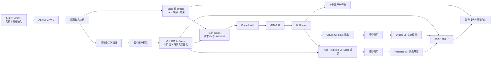
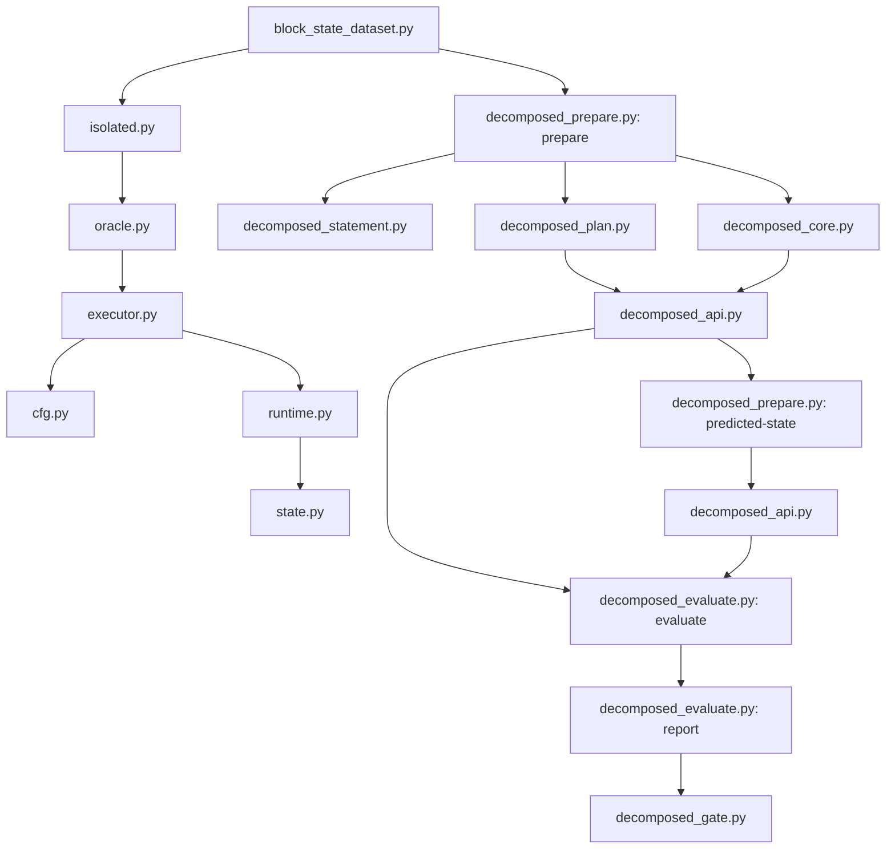

# `codex/g3-decomposed-execution` 分支说明

本文面向第一次接触本仓库的读者，说明粒度 3 控制流与变量状态解耦实验的研究问题、数据生成、模型调用、评分方式、代码调用关系和结果复现入口。

本分支的正式协议为 `g3-decomposed-v2`。正式 MBPP+ 实验于 2026-09-02 使用 `gpt-5.4`、`reasoning_effort=low`、`verbosity=low`、API JSON mode 和 16,384 completion-token 上限完成。固定结果包位于 [`decomposed_results_full_v2/`](decomposed_results_full_v2/README.md)。

> 仓库中还保留了旧版“控制流和变量变化一次联合返回”的实验。本文只介绍本分支新增的解耦实验；旧版结果用于有限的兼容性比较，不能把旧 `changes_exact` 与新 `state_exact` 直接视为同一指标。

## 1. 实验要回答什么

旧版粒度 3 让模型在一次回答中同时生成压缩控制流和多变量变化，控制流错误、状态计算错误与复杂输出协议会混在一起。解耦协议把每个具体程序输入拆成：

```text
1 个 Control-Flow Task
+
k 个 Variable-State Tasks（每个被跟踪变量一个）
```

据此分别回答：

1. 模型能否预测该输入实际经过的基本块序列？
2. 给定本地标准路径时，模型能否维护一个目标变量的动态状态？
3. 把标准路径换成模型预测路径后，状态准确率如何变化？
4. 完整端到端失败来自控制流还是变量状态？

这里的“数据流”具体指目标变量的状态序列：函数入口值，加上该变量每次真正变化后的新值。它不是静态 def-use 图；读取变量或赋相同值不会新增状态位置。

## 2. 三种模型任务

| 条件 | 模型看到的输入 | 模型输出 | 测量对象 |
| --- | --- | --- | --- |
| Control Flow | 函数签名、实参、Block/CFG、静态上下文 | `{"trace":[[path,count],...]}` | 动态基本块路径 |
| Oracle-CF State | 上述信息、本地标准 trace、一个目标变量 | `{"states":[entry,change1,...]}` | 控制流已知时的状态维护 |
| Predicted-CF State | 上述信息、模型预测 trace、同一目标变量 | 相同的 `states` 格式 | 控制流错误的端到端影响 |

Oracle-CF 与 Predicted-CF 使用相同状态 Oracle，只有请求中的 `execution_trace` 来源不同。来源标签保存在模型不可见的元数据中，不放入提示词。

## 3. 完整实验流程



流程中的关键约束如下：

- Block 插桩执行结果必须与未插桩执行结果一致。
- 语句级状态插桩结果也必须与可信运行结果一致，否则该状态案例被排除。
- Control 与 Oracle-CF State 可以并行调用；Predicted-CF State 必须等待 Control 回答后构造。
- 格式无效的 Control 回答不会被修补或伪造 trace；对应状态请求无法构造，并在全口径联合指标中计为失败。
- 能力统计采用首个收到的模型回答。格式无效首答不重试选优；未收到回答或网络错误可以断点续跑。

方法图和真实案例图分别见 [`METHOD_OVERVIEW.png`](decomposed_results_full_v2/METHOD_OVERVIEW.png) 与 [`CASE_STUDY.png`](decomposed_results_full_v2/CASE_STUDY.png)。

## 4. Oracle 如何生成

### 4.1 Block 控制流

`cfg.py` 使用 AST 为目标函数建立基本块和有类型的 CFG 边；`executor.py` 同时执行原函数与插桩函数，验证两者返回值和行级行为一致；`runtime.py` 记录实际进入的 Block 及状态快照。执行过程放入独立子进程，并设置超时、事件数和输出大小限制，避免单个异常案例阻塞全量实验。

例如循环路径：

```text
B001 → (B002 → B003) × 15 → B002(exit) → B004
```

保存为压缩 trace：

```json
{"trace":[["B001",1],["B002>B003",15],["B002",1],["B004",1]]}
```

### 4.2 逐变量状态

Block 事件不足以保留同一 Block 内的多次赋值，因此 `decomposed_statement.py` 对目标函数做第二次语句级 AST 插桩。每条语句后比较前后状态，`decomposed_core.state_sequences_from_events()` 再按变量投影为独立序列：

```json
{"states":[999999999,1000000511,1000008703,1002105855]}
```

状态值经过确定性规范化，以 JSON 表示 Python 类型：未定义值使用 `{"$u":1}`，tuple、dict、set 和特殊浮点数分别使用 `$t`、`$d`、`$s`、`$f` 标记。

## 5. 代码树与模块职责

```text
granularity3_local/
├── cfg.py                       AST 基本块、CFG 边与 Block 插桩
├── executor.py                  原始/插桩执行及语义一致性验证
├── runtime.py                   Block 运行事件与状态快照
├── state.py                     Python 值和状态的规范化与差分
├── oracle.py                    单案例动态 Oracle 封装
├── isolated.py                  超时受控的子进程执行
├── preflight.py                 数据集任务预检和目标函数识别
├── block_state_local.py         单案例模型输入、Block trace 基础表示
├── block_state_dataset.py       全数据集基础 Oracle 生成
│
├── decomposed_statement.py      语句级状态插桩和语义保持检查
├── decomposed_core.py           提示词、schema、响应校验和单项评分
├── decomposed_prepare.py        Control/Oracle-State/Predicted-State 数据生成
├── decomposed_plan.py           cohort 冻结、规模审计、分层 canary
├── decomposed_api.py            并发 API、首答记录、断点恢复、自动分项评分
├── decomposed_evaluate.py       离线复评、联合报告、旧版兼容子集
├── decomposed_gate.py           格式、完整性和 finish_reason 质量门禁
│
├── tests/test_decomposed.py     解耦协议与端到端单元测试
├── DECOMPOSED_EXECUTION.md      完整命令和协议细节
└── decomposed_results_full_v2/  已归档的正式请求、响应、Oracle 与评分
```

主要调用关系：



## 6. 数据与结果规模

| 项目 | 正式数量 |
| --- | ---: |
| Control 案例 / 具体输入 | 3,591 |
| MBPP+ task | 366 |
| 有被跟踪变量真实变化的案例 | 1,117 |
| 没有被跟踪变量真实变化的案例 | 2,473 |
| Oracle-CF 状态请求 / 变量 | 2,241 |
| 可构造的 Predicted-CF 状态请求 | 2,218 |
| 因 Control 格式无效而无法构造 | 23 |

没有变量真实变化的 2,473 个案例仍参与 Control 评估，但不人为制造无信息的 State Task。冻结 cohort 的 ID 和 SHA-256 位于结果包 `cohort/` 中。

主要全请求结果：

| 指标 | 结果 |
| --- | ---: |
| Control 格式有效率 | 98.9696% |
| Control canonical trace exact | 91.6736% |
| Control expanded trace exact | 95.0710% |
| Oracle-CF 状态变量 exact | 73.8956% |
| Predicted-CF 状态变量 exact | 70.8612% |
| 端到端变量联合 exact | 59.5716% |
| 端到端案例全部变量联合 exact | 54.7896% |
| Oracle-CF 到 Predicted-CF 净差值 | 3.0344 个百分点 |

`canonical_trace_exact` 要求压缩分段与 Oracle 完全相同；`expanded_trace_exact` 比较压缩表示所代表的完整 Block 序列，是主控制流指标。所有 `*_all_requests` 指标都把缺失和格式无效回答计为失败。

## 7. 正式结果目录怎么读

```text
decomposed_results_full_v2/
├── README.md                 结果摘要、实验口径和复评入口
├── METHOD_OVERVIEW.png       完整方法图
├── CASE_STUDY.png            单案例控制流与状态比较
├── cohort/
│   ├── prepare_summary.json  数据准备规模和排除统计
│   ├── plan_summary.json     冻结 cohort、长度和值类型分布
│   └── predicted_excluded.jsonl
├── control/                  Control 请求、Oracle、首答、预测和评分
├── oracle_state/             Oracle-CF State 的同类文件
├── predicted_state/          Predicted-CF State 的同类文件
├── combined/                 三条件逐变量/逐案例/逐 task 联合评分
│   └── quality_gate.json     正式质量门禁
└── legacy_compatibility/     仅限状态语义兼容子集的旧版比较
```

三个模型条件目录中的文件含义相同：

| 文件 | 含义 |
| --- | --- |
| `run_config.json` | 模型和生成配置 |
| `requests.jsonl` | 实际模型输入，不含 system prompt |
| `oracles.jsonl` | 本地标准答案 |
| `received_attempts.jsonl` | 最终首答、token、耗时和校验状态 |
| `predictions.jsonl` | 从有效回答解析出的预测 |
| `scores.jsonl` | 逐请求严格比较结果 |
| `case_scores.jsonl` | 一个输入下全部变量的聚合结果；Control 无此层时为空 |
| `task_scores.jsonl` | task 宏平均所需结果 |
| `length_bin_scores.jsonl` | 状态长度分桶；当前 Control 文件为空 |
| `response_errors.jsonl` | 缺失或格式无效回答 |
| `summary.json` | 阶段汇总 |

API 不提供模型隐藏思维链。“推理结果”在本实验中指模型最终 JSON；`received_attempts.jsonl` 只额外保存 reasoning token 数量。

## 8. 不调用模型，离线复评正式结果

下列命令在仓库根目录执行，写入已被 `.gitignore` 排除的 `tmp/`，不会覆盖正式结果：

```powershell
$result = "granularity3_local/decomposed_results_full_v2"
$reproduced = "tmp/g3_decomposed_reproduced"

python -m granularity3_local.decomposed_evaluate evaluate `
  --requests "$result/control/requests.jsonl" `
  --oracles "$result/control/oracles.jsonl" `
  --responses "$result/control/received_attempts.jsonl" `
  --output-dir "$reproduced/control"

python -m granularity3_local.decomposed_evaluate evaluate `
  --requests "$result/oracle_state/requests.jsonl" `
  --oracles "$result/oracle_state/oracles.jsonl" `
  --responses "$result/oracle_state/received_attempts.jsonl" `
  --output-dir "$reproduced/oracle_state"

python -m granularity3_local.decomposed_evaluate evaluate `
  --requests "$result/predicted_state/requests.jsonl" `
  --oracles "$result/predicted_state/oracles.jsonl" `
  --responses "$result/predicted_state/received_attempts.jsonl" `
  --output-dir "$reproduced/predicted_state"

python -m granularity3_local.decomposed_evaluate report `
  --control-requests "$result/control/requests.jsonl" `
  --control-scores "$reproduced/control/scores.jsonl" `
  --oracle-state-requests "$result/oracle_state/requests.jsonl" `
  --oracle-state-scores "$reproduced/oracle_state/scores.jsonl" `
  --predicted-state-requests "$result/predicted_state/requests.jsonl" `
  --predicted-state-scores "$reproduced/predicted_state/scores.jsonl" `
  --output-dir "$reproduced/combined"
```

复评无需 API 密钥，也不需要未提交的逐案例 Oracle 目录。三路复评的 `scores.jsonl` 应与正式对应文件逐字节一致；复评生成的阶段 `summary.json` 对应正式阶段 `summary.json` 内的 `evaluation` 字段，因为正式文件外层还保存 API 运行统计。联合 `summary.json` 和 `scores.jsonl` 应与正式 `combined/` 文件逐字节一致。

## 9. 从源数据重新运行

环境文件固定 Python 3.9，核心本地流水线只使用标准库：

```powershell
conda env create -f granularity3_local/environment.yml
conda activate granularity3
python -m unittest discover -s granularity3_local/tests -p "test*.py"
```

准备包含 `task_*/code.py` 和标准化输入文件的 MBPP+ 数据后，依次执行：

1. `block_state_dataset.py`：隔离运行所有代码和输入，生成基础 Block Oracle。
2. `decomposed_prepare.py prepare`：生成 Control 与 Oracle-CF State 数据，并验证语句级状态插桩。
3. `decomposed_plan.py`：冻结完整 cohort、生成 ID 清单并选择 canary。
4. `decomposed_api.py`：分别运行 Control 和 Oracle-CF State。
5. `decomposed_prepare.py predicted-state`：将有效 Control 首答转换为 Predicted-CF State 请求。
6. `decomposed_api.py`：运行 Predicted-CF State。
7. `decomposed_evaluate.py report`：生成联合评分。
8. `decomposed_gate.py`：检查格式有效率、响应完整性和 `finish_reason`。

完整参数和正式命令见 [`DECOMPOSED_EXECUTION.md`](DECOMPOSED_EXECUTION.md)。在线调用需要环境变量 `YUNWU_API_KEY`，模型和 API 地址可由 `--model`、`--base-url` 或对应环境变量指定。新运行必须写入新目录；不要覆盖固定的正式结果包。

## 10. 如何解释结果

- 95.0710% 是已提供 Block/CFG 后的控制流展开轨迹准确率，不是完整程序执行准确率。全量中大量轨迹很短，复杂度分析应同时报告长度分桶和重复 Block 子集。
- Oracle-CF State 测量真实路径已知时的变量状态维护；Predicted-CF State 加入了预测路径影响；端到端联合指标还要求控制流正确。
- Oracle-CF 与 Predicted-CF 是两次独立 API 调用。同一可见输入也可能产生不同回答，因此净差值应结合逐变量配对转移分析，不宜把每个由对变错都解释为路径造成的因果效应。
- 旧版联合 Oracle 按 run 聚合，同一 Block 内多次赋值可能被压缩；新版保留每次语句级真实变化。旧版只在 `legacy_compatibility/` 标记的兼容子集上可公平比较。
- MBPP+ 是公开基准，模型可能熟悉部分程序结构；具体输入、动态循环次数和本地 Block 编号仍需运行时推理，但公开基准污染应作为有效性威胁报告。

## 11. 新读者建议阅读顺序

1. 本文：理解研究问题、流程和代码入口。
2. [`decomposed_results_full_v2/README.md`](decomposed_results_full_v2/README.md)：查看正式规模、结果和文件说明。
3. [`decomposed_results_full_v2/CASE_STUDY.png`](decomposed_results_full_v2/CASE_STUDY.png)：理解一个具体控制流正确但状态错误的案例。
4. [`DECOMPOSED_EXECUTION.md`](DECOMPOSED_EXECUTION.md)：查看协议细节与完整运行命令。
5. `decomposed_core.py`、`decomposed_prepare.py`、`decomposed_evaluate.py`：核对数据契约和评分实现。
