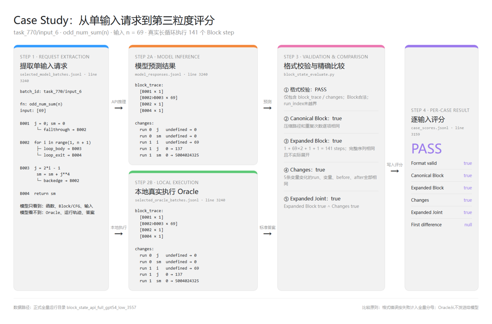
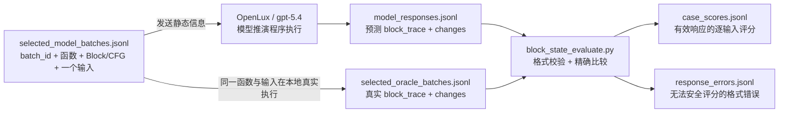

# 第三粒度实验 Case Study

本文使用两个正式实验中的真实输入，展示请求如何从 `selected_model_batches.jsonl` 提取、模型如何返回推理结果、本地执行器如何生成 Oracle，以及 `block_state_evaluate.py` 如何给出逐输入结论。



## 1. 单输入数据流



Oracle 不会发送给模型。模型只能看到函数、静态 Block/CFG 和一个具体输入。

## 2. 如何提取同一个 case

在项目根目录执行：

```powershell
$caseKey = 'task_2/input_1'
$runDir = 'granularity3_local\block_state_api_full_gpt54_low_3557'

Select-String -LiteralPath "$runDir\selected_model_batches.jsonl" `
  -SimpleMatch "`"batch_id`": `"$caseKey`""

Select-String -LiteralPath "$runDir\model_responses.jsonl" `
  -SimpleMatch "`"batch_id`": `"$caseKey`""

Select-String -LiteralPath "$runDir\selected_oracle_batches.jsonl" `
  -SimpleMatch "`"batch_id`": `"$caseKey`""

Select-String -LiteralPath "$runDir\evaluation\case_scores.jsonl" `
  -SimpleMatch "`"case_key`": `"$caseKey`""

Select-String -LiteralPath "$runDir\evaluation\response_errors.jsonl" `
  -SimpleMatch "`"batch_id`": `"$caseKey`""
```

有效响应会出现在 `case_scores.jsonl`；格式无效响应会出现在 `response_errors.jsonl`，二者不会同时出现。

## 3. Case A：完全正确的简单分支

Case：`task_2/input_1`

### 3.1 请求提取

来源：`selected_model_batches.jsonl:1`

```json
{
  "batch_id": "task_2/input_1",
  "request": {
    "fn": "similar_elements(test_tup1, test_tup2)",
    "blocks": [
      [
        "B001",
        "return tuple(set(test_tup1) & set(test_tup2))",
        [["return", null]]
      ]
    ],
    "cases": [
      {
        "id": "input_1",
        "args": [
          {"$t": [3, 4, 5, 6]},
          {"$t": [5, 7, 4, 10]}
        ]
      }
    ]
  },
  "response_format": "flat_runs"
}
```

模型据此判断函数只经过 `B001`，且没有需要记录的局部变量变化。

### 3.2 模型推理结果

来源：`model_responses.jsonl:1`

```json
{
  "block_trace": [["B001", 1]],
  "changes": []
}
```

### 3.3 本地真实执行结果

来源：`selected_oracle_batches.jsonl:1`

```json
{
  "id": "input_1",
  "block_trace": [["B001", 1]],
  "changes": []
}
```

### 3.4 比较过程

```text
格式校验：PASS

Canonical Block：
  模型 [["B001",1]] == Oracle [["B001",1]]
  → true

Expanded Block：
  模型完整序列 B001 == Oracle完整序列 B001
  → true

Changes：
  模型 [] == Oracle []
  → true

Expanded Joint：
  Expanded Block true AND Changes true
  → true
```

### 3.5 逐输入结果

来源：`evaluation/case_scores.jsonl:1`

```json
{
  "case_key": "task_2/input_1",
  "canonical_block_exact": true,
  "expanded_block_exact": true,
  "changes_exact": true,
  "canonical_joint_exact": true,
  "expanded_joint_exact": true,
  "first_block_difference": null,
  "first_change_difference": null
}
```

## 4. Case B：Block正确但长循环状态格式错误

Case：`task_770/input_7`

### 4.1 请求提取

来源：`selected_model_batches.jsonl:3241`

```text
fn: odd_num_sum(n)
args: [70]

B001: j = 0; sm = 0
B002: for i in range(1, n + 1)
B003: j = 2*i-1; sm = sm + j**4
B004: return sm

静态CFG：B001 → B002 → B003 ↩ B002 → B004
```

### 4.2 本地执行器生成的 Oracle

来源：`selected_oracle_batches.jsonl:3241`

```json
{
  "block_trace": [
    ["B001", 1],
    ["B002>B003", 70],
    ["B002", 1],
    ["B004", 1]
  ],
  "changes": [
    [0, "j", {"$u": 1}, 0],
    [0, "sm", {"$u": 1}, 0],
    [1, "i", {"$u": 1}, 70],
    [1, "j", 0, 139],
    [1, "sm", 0, 5377325366]
  ]
}
```

70轮相同循环路径被压缩成一个运行段 `run_index=1`。变量变化只保留该运行段第一次变化前和最后一次变化后的值。

### 4.3 模型推理结果

来源：`model_responses.jsonl:3241`

模型预测的 Block 与 Oracle 相同：

```json
[
  ["B001", 1],
  ["B002>B003", 70],
  ["B002", 1],
  ["B004", 1]
]
```

但模型返回了142条 `changes`，把每轮循环当成新的运行段：

```json
[
  [0, "j", {"$u": 1}, 0],
  [0, "sm", {"$u": 1}, 0],
  [1, "j", 0, 1],
  [1, "sm", 0, 1],
  [2, "j", 1, 3],
  [2, "sm", 1, 82],
  [3, "j", 3, 5],
  [3, "sm", 82, 707],
  [4, "j", 5, 7]
]
```

`block_trace`只有4个压缩运行段，合法索引为 `0、1、2、3`。模型从第9条变化开始使用 `run_index=4`，因此无法与压缩Block序列对应。

### 4.4 校验结果

来源：`evaluation/response_errors.jsonl:82`

```json
{
  "batch_id": "task_770/input_7",
  "status": "invalid_response",
  "reason": "changes[8] step 4 is outside block_trace"
}
```

该输入在内容比较前就因格式不一致被拒绝：

```text
len(block_trace) = 4
合法 run_index = 0..3
模型 changes[8].run_index = 4
4 >= 4 → invalid_response
```

该case不进入 `case_scores.jsonl`，但在以全部3557个输入为分母的准确率中按错误计为0。它不会被重新请求替换。

## 5. 实际比较函数

核心评分位于 `block_state_evaluate.py::score_prediction`：

```python
canonical_block_exact = (
    predicted["block_trace"] == oracle["block_trace"]
)

expanded_block_exact = _expanded_block_exact(
    predicted["block_trace"],
    oracle["block_trace"],
)

changes_exact = (
    predicted["changes"] == oracle["changes"]
)

canonical_joint_exact = (
    canonical_block_exact and changes_exact
)

expanded_joint_exact = (
    expanded_block_exact and changes_exact
)
```

`canonical_block_exact`要求压缩行、路径和次数逐项相同。`expanded_block_exact`调用 `flat_run_traces_equal`，比较压缩表示所代表的完整Block序列，但不会真正展开超长循环。

## 6. 从原始文件重新生成比较结果

```powershell
conda run -n Npflower python -m granularity3_local.block_state_evaluate `
  --model-batches granularity3_local\block_state_api_full_gpt54_low_3557\selected_model_batches.jsonl `
  --oracle-batches granularity3_local\block_state_api_full_gpt54_low_3557\selected_oracle_batches.jsonl `
  --responses granularity3_local\block_state_api_full_gpt54_low_3557\model_responses.jsonl `
  --output-dir granularity3_local\block_state_api_full_gpt54_low_3557\evaluation_reproduced `
  --allow-partial
```

该命令不会调用API，只使用已经保存的请求、模型响应和Oracle重新生成逐输入评分与汇总指标。
